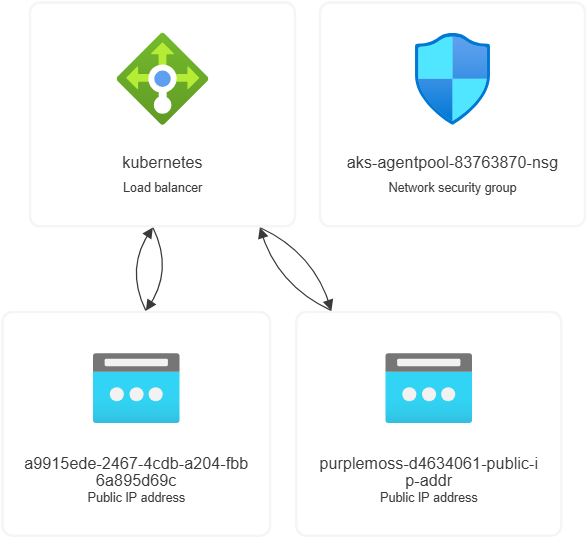

# ✅ SimpleTimeService Deployment Documentation

## 👨‍💻 Author
**Teja Surendar Reddy**  
DevOps Engineer | Cloud Enthusiast  
📧 Email: ktsreddy007@gmail.com

---
## 🧾 Overview

**SimpleTimeService** is a lightweight microservice built in **C# (.NET 8)** that returns the current timestamp (India Standard Time) and the visitor's IP address in JSON format.

### Key Features
- Containerized using Docker with a **non-root user**
- Image published to **DockerHub**: `ktsreddy/teja_particle41_devops-challenge:v1.0`
- Deployed to **Azure Container Apps** via **modular Terraform**
- Integrated with a private subnet inside a **custom VNet**

---

## 🌍 Example Application URL
> [https://teja-aca--z3o5mig.purplemoss-d4634061.southindia.azurecontainerapps.io/](https://teja-aca--z3o5mig.purplemoss-d4634061.southindia.azurecontainerapps.io/)
>
> _Note: The domain may vary depending on your Azure configuration._

---

## 📦 Sample JSON Response

```json
{
  "timestamp": "<User current date & Time>",
  "ip": "<visitor's IP address>"
}
```
---

## 🧰 Technology Stack

| Layer             | Technology                                      |
|------------------|--------------------------------------------------|
| Language          | C# (.NET 8)                                     |
| Containerization  | Docker (multi-stage, non-root)                  |
| Cloud Provider    | Microsoft Azure                                 |
| Deployment        | Azure Container Apps                            |
| Infra-as-Code     | Terraform (modular architecture)                |
| Container Registry| Docker Hub (`ktsreddy/teja_particle41_devops-challenge:v1.0`) |

---

## 🗂️ Project Structure

```
PARTICLE41_DEVOPS_CHALLENGE/
├── SimpleTimeService_app/
│   ├── bin/
│   ├── obj/
│   ├── Controllers/
│   │   └── TimeController.cs
│   ├── Properties/
│   ├── .dockerignore
│   ├── appsettings.Development.json
│   ├── appsettings.json
│   ├── Dockerfile
│   ├── Program.cs
│   ├── SimpleTimeService.csproj
│   ├── SimpleTimeService.http
│   └── SimpleTimeService.sln
├── terraform/
│   ├── env/
│   │   └── dev/
│   │       ├── .terraform/
│   │       ├── .env
│   │       ├── .env.template
│   │       ├── main.tf
│   │       ├── outputs.tf
│   │       ├── terraform.tfstate
│   │       ├── terraform.tfvars
│   │       ├── terraform.tfvars.example
│   │       └── variables.tf
│   ├── modules/
│   │   ├── container_app/
│   │   ├── network/
│   │   └── resource_group/
│   └── .gitignore
├── Particle41_DevOps_Challenge.sln
└── README.md
```
---
## 🚀 Deployment Guide

### 🛠️ Prerequisites
- Azure CLI for authenticating (`az login`) & for creating (`ServicePricipal`,`ResourceProviders`)
- Terraform installed (`>=1.3`)
- Docker installed (`28.2.2`) for image builds
- DockerHub account with `public repo` where image published
- Azure Cloud Account (`Free Subscription Needed`)
- Azure Resources we create (`Service Principal Id`,`Resource Group`,`Az Public Subnet`,`Az Private Subnet`,`Az Container App Environment`,`Az Container App`)
### 🐳 Build and Push Docker Image

```bash
docker build -t ktsreddy/teja_particle41_devops-challenge:v1.0 .
docker push ktsreddy/teja_particle41_devops-challenge:v1.0
```
### To Pull the image from docker hub registry to your local (Optional)
```
docker pull ktsreddy/teja_particle41_devops-challenge:v1.0
```
### ☁️ Deploying Infrastructure via Terraform to Azure Cloud

```bash
cd terraform/env/dev
terraform init
terraform plan -out=tfplan or terraform plan
terraform validate
terraform apply tfplan or terraform apply
```
Note: All the values shown here are for example in your case u can use your own values

Terraform provisions:
- Resource Group:`Tejarg`
- VNet: `tejavnet` with 2 public & 2 private subnets
- Azure Container App Environment: `teja-aca-env`
- Container App: `teja-aca` integrated with private subnet
- Public ingress enabled via Azure-managed domain
---
## 📡 Azure Infrastructure Overview

**Provisioned Resources:**
- `Tejarg` (Resource Group)
- `tejavnet` (Virtual Network with 4 subnets(2 Private,2 Public))
- `teja-aca-env` (Container App Environment)
- `teja-aca` (Container App)
- `kubernetes` load balancer (default from AKS infra via Az Container App)
- `aks-agentpool-*` NSG (auto-generated)

Note : `You may see AKS-related resources like load balancers, NSGs automatically generated. This is normal when using Azure Container Apps with VNet integration.`

## Screenshots
<p float="center">
  
  
</p>

---

## 🧪 Validation via shell or on website

```bash
curl https://teja-aca--z3o5mig.purplemoss-d4634061.southindia.azurecontainerapps.io/
```
Expected output:


---
## 📌 Notes
- The Container App uses **built-in ingress** to expose the service publicly.So we didnt setup additional API Gateway.
- The infrastructure adheres to **best practices** including use of:
  - Implemented conditional startup with manual logging logic at application code level
  - Private subnet integration
  - Modular, reusable Terraform code
  - Secure non-root Docker container
---
## 🔒 Security Considerations

- **Non-root user** in Docker image (`USER myuser`)
- **Ingress HTTPS auto-enabled** via Azure
- **IP address masking** if needed can be applied using Application Gateway or header filtering (didn't implemented)
---