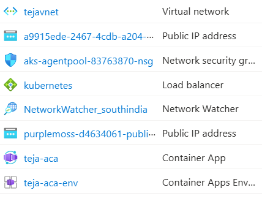
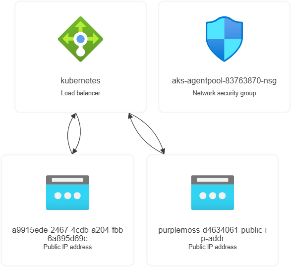
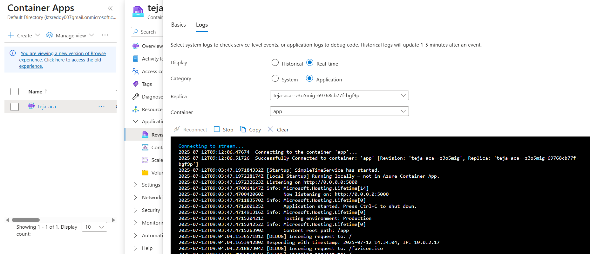
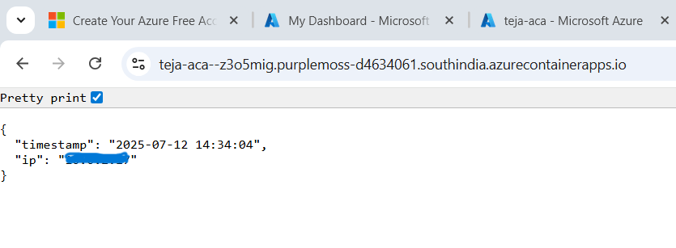

# ✅ SimpleTimeService Deployment Documentation

## 👨‍💻 Author
**Teja Surendar Reddy**  
DevOps Engineer | Cloud Enthusiast  
📧 Email: ktsreddy007@gmail.com

---
## 🧾 Overview

**SimpleTimeService** is a lightweight microservice built in **C# (.NET 8)** that returns the current timestamp (India Standard Time) and the visitor's IP address in JSON format.

### Key Features
- Containerized using Docker with a **non-root user**
- Image hosted on **DockerHub**: [`ktsreddy/teja_particle41_devops-challenge:v1.0`](https://hub.docker.com/r/ktsreddy/teja_particle41_devops-challenge)
- Deployed to **Azure Container Apps** via **modular Terraform**
- Integrated with a private subnet inside a **custom VNet**
---
## 🌍 Example Application URL
[https://teja-aca--z3o5mig.purplemoss-d4634061.southindia.azurecontainerapps.io/](https://teja-aca--z3o5mig.purplemoss-d4634061.southindia.azurecontainerapps.io/)

`Note: The domain may vary depending on your Azure configuration.`

---

## 📦 Sample JSON Response

```json
{
  "timestamp": "<User current date & Time>",
  "ip": "<visitor's IP address>"
}
```
---

## 🧰 Technology Stack

| Layer             | Technology                                      |
|------------------|--------------------------------------------------|
| Language          | C# (.NET 8)                                     |
| Containerization  | Docker (multi-stage, non-root)                  |
| Cloud Provider    | Microsoft Azure                                 |
| Deployment        | Azure Container Apps                            |
| Infra-as-Code     | Terraform (modular architecture)                |
| Container Registry| Docker Hub                                      |

---

## 🗂️ Project Structure

```
PARTICLE41_DEVOPS_CHALLENGE/
├── SimpleTimeService_app/                               # C# Source Code
│   ├── bin/
│   ├── obj/
│   ├── Controllers/
│   │   └── TimeController.cs
│   ├── Properties/
│   ├── .dockerignore
│   ├── appsettings.Development.json
│   ├── appsettings.json
│   ├── Dockerfile
│   ├── Program.cs
│   ├── SimpleTimeService.csproj
│   ├── SimpleTimeService.http
│   └── SimpleTimeService.sln
├── terraform/                                           # Terraform IaC setup
│   ├── env/                                   # Environment-specific configs & root module
│   │   └── dev/                                # Execute your terraform commands from here
│   │       ├── .terraform/
│   │       ├── .env
│   │       ├── .env.template
│   │       ├── main.tf
│   │       ├── outputs.tf
│   │       ├── terraform.tfstate
│   │       ├── terraform.tfvars
│   │       ├── terraform.tfvars.example
│   │       └── variables.tf
│   ├── modules/                                        # Reusable modules
│   │   ├── container_app/
│   │   ├── network/
│   │   └── resource_group/
│   └── .gitignore
├── Particle41_DevOps_Challenge.sln
├── images                                        # Architecture & output screenshots
└── README.md
```
---
## 🚀 Deployment Guide

### 🛠️ Prerequisites
| Tool              | Purpose                         | Install Link                                                                       |
| ----------------- | ------------------------------- | ---------------------------------------------------------------------------------- |
| **Azure CLI**     | Login, create service principal | [Install Azure CLI](https://learn.microsoft.com/en-us/cli/azure/install-azure-cli) |
| **Terraform**     | Provision cloud infrastructure  | [Install Terraform](https://developer.hashicorp.com/terraform/downloads)           |
| **Docker**        | Build container image           | [Install Docker](https://docs.docker.com/get-docker/)                                   |
| **DockerHub**     | Push cotainer image             | [Login into DockerHub](https://hub.docker.com/)                                           |
| **Azure Account** | Required to provision resources | [Azure Free Tier](https://azure.microsoft.com/en-in/free/)                         |

### 🔐 Authentication & Azure Credentials
1. Login to Azure CLI:
```bash
az login
```
2. Create Service Principal for Terraform:
```bash
az ad sp create-for-rbac --name "Your_sp_name" --role="Contributor" --scopes="/subscriptions/<your-subscription-id>" --sdk-auth
```
3. Get below details and save in .env file :
```bash
ARM_CLIENT_ID=<appId>
ARM_CLIENT_SECRET=<password>
ARM_SUBSCRIPTION_ID=<subscriptionId>
ARM_TENANT_ID=<tenant>
```
### 🐳 Docker Image
4. 🔧 Build & Push Image to Docker Hub
```bash
cd SimpleTimeService_app
docker build -t ktsreddy/teja_particle41_devops-challenge:v1.0 .
docker push ktsreddy/teja_particle41_devops-challenge:v1.0
```
### ⬇️ Pull the docker image to your local (Optional)
```bash
docker pull ktsreddy/teja_particle41_devops-challenge:v1.0
```
### ☁️ Deploying Infrastructure via Terraform to Azure Cloud
5. 📂Navigate to Terraform Environment Folder
```bash
cd terraform/env/dev
```
6. 🔄Configure Variables by editing terraform.tfvars or create a new file using:
```bash
cp terraform.tfvars.example terraform.tfvars
```
Note: `Update the values as per your Azure setup`(resource group, image name, subnet names, etc.).

7. ⚙️Run Terraform Commands
```bash
terraform init
terraform validate
terraform plan -out=tfplan or terraform plan
terraform apply tfplan or terraform apply
```
✅ This will provision:
- Resource Group: Tejarg
- VNet with 2 public & 2 private subnets
- Azure Container App Environment: teja-aca-env
- Container App: teja-aca (with public ingress)
- VNet integration (private subnet)

---
## 📡 Infrastructure Overview

**Provisioned Azure Resources:**
- `Tejarg` (Resource Group)
- `tejavnet` (Virtual Network with 4 subnets(2 Private,2 Public))
- `teja-aca-env` (Container App Environment)
- `teja-aca` (Container App)
- `kubernetes` load balancer (default from AKS infra via Az Container App)
- `aks-agentpool-*` NSG (auto-generated)

Note : `You may see AKS-related resources like load balancers, NSGs automatically generated. This is normal when using Azure Container Apps with VNet integration.`

## Screenshots
<p float="center">
  <br/>
  <strong>Azure_Resources:</strong> These are provisioned resources we will see once terraform has deployed<br/><br/>
  
  <br/>
  <strong>Azure_Resources:</strong> This is the interal network arcitecture how the ACA works with default K8 loadbalancer and NSG's<br/><br/>
  
  <br/>
  <strong>ACA Log:</strong> It shows that our container is pulled and runnng successfully in ACA Log on Azure.
</p>

---

## 🧪 Validate the Deployment

```bash
curl https://teja-aca--z3o5mig.purplemoss-d4634061.southindia.azurecontainerapps.io/
```
> **Expected output:**
 

---

## 📌 Notes
- The Container App uses **built-in ingress** to expose the service publicly.So we didnt setup additional API Gateway.
- The infrastructure adheres to **best practices** including use of:
  - Implemented **`conditional startup with manual logging logic`** at application code level
  - Private subnet integration
  - `Modular`, `reusable` Terraform code
  - Secure `non-root Docker container`
---
## 🔒 Security Considerations

- ✅ Docker image runs as **non-root user (`USER myuser`)**
- ✅ **Ingress HTTPS automatically enabled (Azure-managed)** via Azure
- ✅ **IP address masking** if needed can be applied using Application Gateway or header filtering (didn't implemented)
---
---

## 📚 Additional Resources

- [Azure Container Apps Documentation](https://learn.microsoft.com/en-us/azure/container-apps/)
- [Terraform Azure Provider](https://registry.terraform.io/providers/hashicorp/azurerm/latest/docs)

---

## 📬 Questions?
Feel free to reach out:  
📧 **ktsreddy007@gmail.com**
